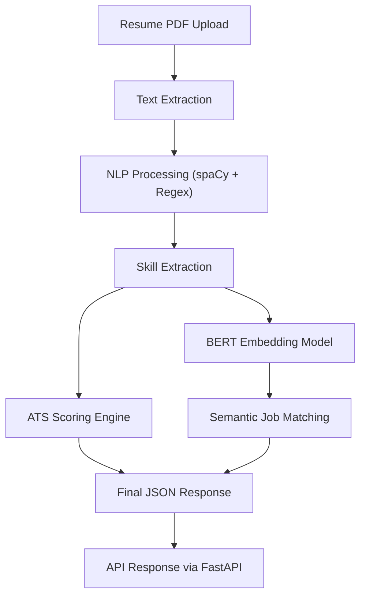

# 🚀 AI Resume Intelligence System

An AI-powered backend system that parses resumes and performs intelligent job matching using NLP and semantic analysis.

---

## 🚀 Tech Stack


---

## ✨ Highlights

- 🚀 End-to-end AI Resume Parsing System
- 🧠 NLP + Transformer-based skill extraction
- ⚡ FastAPI high-performance backend
- 🐳 Dockerized deployment ready
- 📊 ATS score calculation + job matching engine
- 🔍 Modular and scalable architecture

---

## ⚙️ Features

- 📄 Resume PDF parsing  
- 🧠 AI-based skill extraction  
- 🎯 ATS score calculation  
- 🤖 BERT-based semantic matching  
- 🔍 Job description matching  
- 📊 Matched & missing skills detection  
- 🚀 FastAPI backend API  

---

## 🧠 Architecture Diagram



---

## 📌 API Endpoints

### POST /parse_resume
Upload resume PDF and extract structured data.

---

### POST /match_resume
Compare resume with job description.

Returns:
- ATS score  
- Match score  
- Skills comparison  

---

## 🛠 Tech Stack (Detailed)

Python • FastAPI • spaCy • BERT • scikit-learn • Docker  

---

## 🚀 Deployment

HuggingFace Spaces (Docker)  
Uvicorn server on port 7860  

---

## 📊 Output Example

```json
{
  "ats_score": 90,
  "match_score": 75,
  "skills": ["python", "fastapi", "nlp"]
}
```